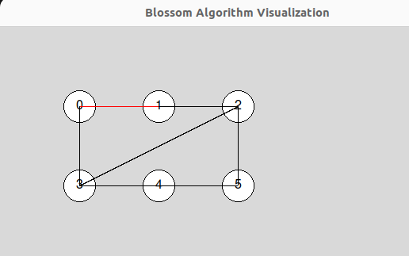
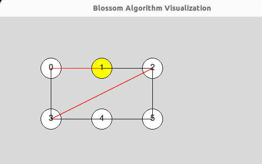
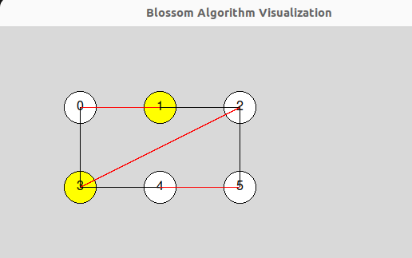

# Blossom Algorithm

This project implements the Blossom algorithm to find the maximum matching in a graph using augmenting paths, which are alternating paths. The project also includes helper functions for BFS traversal, contracting nodes, and manipulating matchings. The visualization is handled using a `GraphVisualizer` class.

## General Explanation of the Blossom Problem

The Blossom algorithm, developed by Jack Edmonds in 1961, is used to find the maximum matching in a graph. The algorithm uses the concept of augmenting paths, which are paths that alternate between edges not in the matching and edges in the matching, to iteratively increase the size of the matching until no more augmenting paths can be found. One of the key challenges the Blossom algorithm addresses is the presence of odd-length cycles (blossoms) in the graph, which it handles through a process called "contracting" these cycles into single nodes to simplify the problem.

## Files

- **blossomAlgo.py**: Contains the `compute_maximum_matching` function and supporting helper functions.
- **graphHelpers.py**: Contains the `Graph`, `Matching`, and other helper classes and functions.
- **graph_visualizer.py**: Contains the `GraphVisualizer` class for drawing and visualizing the graph.
- **main.py**: Runs an example of the Blossom algorithm on a sample graph and visualizes the steps.
- **test_blossom.py**: Contains unit tests for the Blossom algorithm functions.

## Visualization

Here are some screenshots of the GUI in action on a simple graph example, demonstrating the algorithm:

### Initial Graph Setup
The initial setup of the graph, with nodes and edges, before running the Blossom algorithm.

### Alternating Paths
Visualization of the alternating paths found by the algorithm. 
The red edges represent the augmenting paths used to increase the matching size.

### Final Maximum Matching
The final graph showing the maximum matching found by the Blossom algorithm. The matching edges are highlighted.

## Getting Started

### Prerequisites

- Python 3.6+
- Required Python packages: `copy`, `collections`, `typing`

